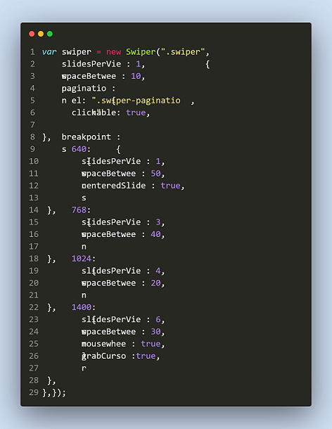

# real-estate

This is a Real Estate Agency based in Australia's website. It contians a homepage, About Us page, Blog Page, For Lease Page and Contact Us page. This website lists the number of properties available for lease and also gives out the location of each house or apartment listed on their website so that you can check it out incase you want to.

## Table of contents

- [Overview](#overview)
  - [Features](#features)
  - [Screenshot](#screenshot)
  - [Links](#links)
- [My process](#my-process)
  - [Built with](#built-with)
  - [What I learned](#what-i-learned)
  - [Continued development](#continued-development)
  - [Useful resources](#useful-resources)
- [Author](#author)
- [Acknowledgments](#acknowledgments)

## Overview

### Features

Users should be able to:

- View the optimal layout for the app depending on their device's screen size
- See hover states for all interactive elements on the page
-lView ive previews
-View Fullscreen mode
-Cross platform

### Screenshot

### Links

- Solution URL: [Frontend Mentor](https://www.frontendmentor.io/solutions/advice-generator-app-cpcuYGnGvQ)
- Live Site URL: [Github](https://kinjames.github.io/advice-generator/)

## My process

### Built with

- Semantic HTML5 markup
- CSS custom properties
- Flexbox
- CSS Grid
- Mobile-first workflow
- [Splide.js](https://splidejs.com/) - JS library
- [Swiper.js](https://swiperjs.com/) - JS library

### What I learned

- How to use swiper js to make a carousel on a webpage.

- How to use splide js library to make a thumbnail carousel on a webpage.

- How to use css user select.

### Continued development

I would like to continue using the javascript libraries to add more functionalities to my websites.

<!-- Use this section to outline areas that you want to continue focusing on in future projects. These could be concepts you're still not completely comfortable with or techniques you found useful that you want to refine and perfect. -->

### Useful resources

<!-- - [Example resource 1](https://www.example.com) - This helped me for XYZ reason. I really liked this pattern and will use it going forward.
- [Example resource 2](https://www.example.com) - This is an amazing article which helped me finally understand XYZ. I'd recommend it to anyone still learning this concept. -->

## Author

- Frontend Mentor - [@kinjames](https://www.frontendmentor.io/profile/kinjames)
- Twitter - [@TheBlackCoder7](https://twitter.com/TheBlackCoder7)

<!-- This real estate website was built with HTML, CSS and JavaScript.
What I learnt from making this project is how to use user select.
How to use swipe js for a swiper and how to use splide js for thumbnail carousel.
I learnt how to use javascript for pagination and also be able to work with arrays.
I learnt how to use meta tags that will prevents telephone numbers color from turning blue
i learnt how to create json files and also use the fetch method to fetch the data from the json
I learnt how to use userinput to filter from an array and also sort
lastly i learnt how to write a detailed readme file -->

<!--  
  Things to do now,
  !. add regex to the form on homepage
  2. add event listeners to the lease section of the homepage
  3. add event listeners to the blog sectio of the home page and work on the arrow pointing downwards
-->

<!-- Next things to look at Reactjs -->
<!-- Next things to look at Node.js -->
<!-- Next things to look at Node.js -->